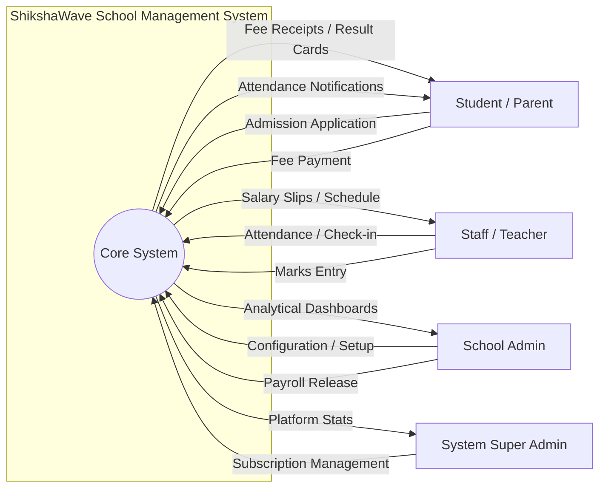
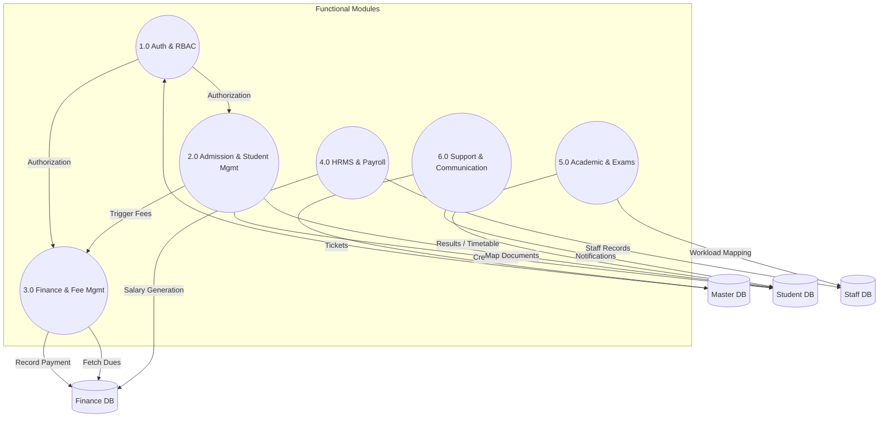

# ShikshaWave: DFD and Database Documentation

This document provides a detailed overview of the Data Flow Diagrams (DFDs) and the core database schema for the ShikshaWave School Management System.

---

## 1. Data Flow Diagrams (DFD)

### 1.1 First Level DFD (Context Diagram)
The Context Diagram shows the high-level boundary of the ShikshaWave system and its interaction with external entities.

---

### 1.2 Second Level DFD (Detailed Process Diagram)
The Level 2 DFD decomposes the system into major functional modules and identifies the data flow between them.

---

## 2. Key Database Tables & Structure

### 2.1 Core System Entities

#### `SchoolMaster` (Multi-Tenancy Anchor)
| Column Name | Data Type | Description |
| :--- | :--- | :--- |
| `SchoolID` (PK) | AutoInt | Unique identifier for each school. |
| `SchoolCode` | Varchar(20) | Unique code for the school entity. |
| `SchoolName` | Varchar(100) | Full name of the school. |
| `RegistrationNumber` | Varchar(50) | Official registration number. |
| `LogoPath` / `SchoolLogo` | Text / Binary | School branding assets. |

#### `UserMaster` (Authentication & Profile)
| Column Name | Data Type | Description |
| :--- | :--- | :--- |
| `UserID` (PK) | AutoInt | Unique identifier for the user. |
| `UserCode` | Varchar(20) | Login username / identifier. |
| `PasswordHash` | Varchar(255) | SHA-256 hashed password. |
| `ProfileID` (FK) | Int | Link to `ProfileMaster` (Role: Admin, Teacher, etc.). |
| `SchoolID` (FK) | Int | Multi-tenant link to `SchoolMaster`. |

---

### 2.2 Student & Academic Entities

#### `StudentMaster` (Core Academic Data)
| Column Name | Data Type | Description |
| :--- | :--- | :--- |
| `StudentID` (PK) | AutoInt | Unique identifier for the student. |
| `AdmissionNo` | Varchar(50) | School-assigned admission number. |
| `FullName` | Varchar(100) | Student's full name. |
| `CurrentClassID` (FK)| Int | Link to `ClassMaster`. |
| `AcademicYearID` (FK)| Int | Current session tracking. |

#### `ClassMaster` & `SectionMaster`
- `ClassMaster`: `ClassID`, `ClassName`, `ClassCode`, `SchoolID`.
- `SectionMaster`: `SectionID`, `ClassID`, `SectionName`, `Capacity`.

---

### 2.3 Financial Entities

#### `FeeType_Master` (Revenue Config)
| Column Name | Data Type | Description |
| :--- | :--- | :--- |
| `FeeTypeId` (PK) | AutoInt | Unique ID for fee type. |
| `FeeTypeName` | Varchar(100) | e.g., Admission Fee, Tuition Fee. |
| `DefaultAmount` | Decimal | Base amount for this fee type. |

#### `Payment` (Transaction Ledger)
| Column Name | Data Type | Description |
| :--- | :--- | :--- |
| `PaymentID` (PK) | AutoInt | Unique transaction ID. |
| `ReceiptNo` | Varchar(50) | Formatted receipt ID (e.g., RCP-...). |
| `StudentID` (FK) | Int | Payer identification. |
| `Amount` | Decimal | Paid amount. |
| `PaymentMode` | Varchar(20) | Cash, Online, Cheque, etc. |

---

### 2.4 HRMS & Support

#### `SalaryComponentMaster`
- `ComponentID`, `ComponentName`, `ComponentType` (Earning/Deduction).

#### `TicketSystem`
- `TicketID`, `Subject`, `Priority`, `Status`, `AssignedTo`, `CreatedBy`.

---

> [!NOTE]
> All critical business logic is implemented via **Stored Procedures** (e.g., `Proc_Student_Admission_With_Documents`, `Proc_Payment_Insert`) to ensure atomic transactions and high performance across the Microsoft SQL Server backend.
